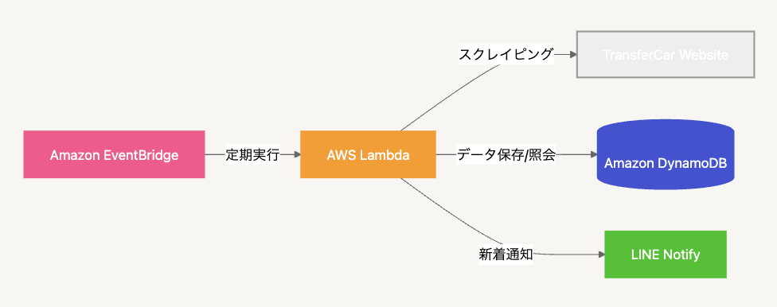
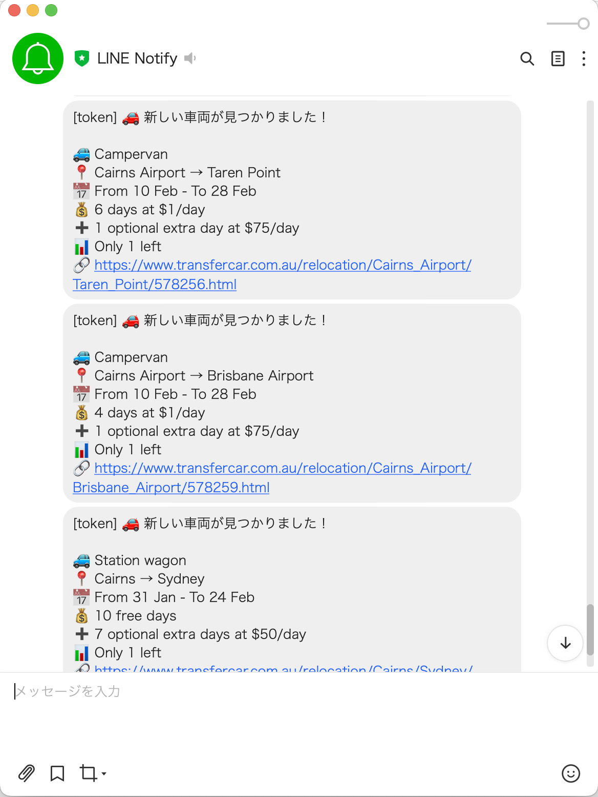
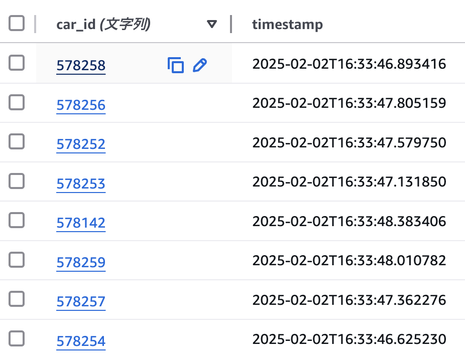

<div align="center">
  <h1>🚗 TransferCar Notifier</h1>
  <p>
    <strong>TransferCarの新着車両を自動検知してLINE通知するAWS Lambda関数</strong>
  </p>
  <p>
    <a href="#概要">概要</a> •
    <a href="#機能">機能</a> •
    <a href="#技術スタック">技術スタック</a> •
    <a href="#セットアップ">セットアップ</a> •
    <a href="#動作例">動作例</a>
  </p>
</div>

---

## 💡 概要

TransferCarの新着車両情報を**自動的に監視**し、新しい車両が登録されたら**即座にLINE通知**を送信するシステムです。手動での定期チェックを自動化し、興味のある車両をリアルタイムで把握できます。

## ✨ 機能

- 🔄 **定期監視**: EventBridgeによる自動スクレイピング
- 🔍 **新着検出**: 新規車両の自動検知
- 📱 **LINE通知**: リアルタイムな通知配信
- 💾 **データ永続化**: DynamoDBによる既知車両の管理

## 🛠 技術スタック

### AWS Services
<p align="center">
  
  
  
  
</p>

### 主要ライブラリ
<p align="center">
  
  
  
</p>

## 🏗 アーキテクチャ

<div align="center">
  
</div>

## 🚀 セットアップ

### 1️. 環境変数の設定
```bash
export LINE_TOKEN="your_line_notify_token"
```

### 2️. AWSリソースの作成
```bash
# DynamoDBテーブルの作成
aws dynamodb create-table \
    --table-name transfer_car_known_cars \
    --attribute-definitions AttributeName=car_id,AttributeType=S \
    --key-schema AttributeName=car_id,KeyType=HASH \
    --billing-mode PAY_PER_REQUEST
```

### 3️. Dockerイメージのビルド・デプロイ
```bash
docker build -t transfercar-notifier .
docker tag transfercar-notifier:latest [ECRリポジトリURI]
docker push [ECRリポジトリURI]
```

## ⚙️ 設定項目

`config.py`で以下の項目をカスタマイズ可能：
- 📅 検索対象の日付
- 📍 出発地・目的地
- 🚗 車両タイプ
- ⏱ スクレイピング間隔
- 🔧 AWS関連設定

## 📱 動作例

### LINE通知


### DynamoDB保存データ


## 📊 コスト目安
- Lambda実行: 約$0.18/月
- ECRストレージ: 約$0.10/月
- DynamoDB: 実質無料（フリーティア内）
- **合計**: 約$0.30/月

## 📝 ライセンス
[MIT License](./LICENSE)

## 👨‍💻 作者
Ayumu Akagi
